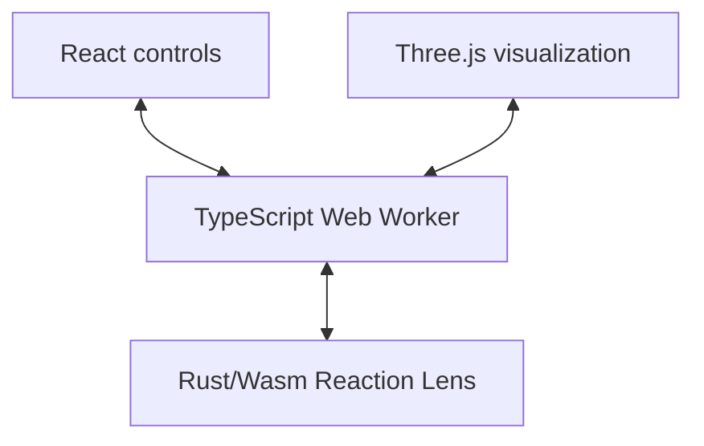

# Two-Photon Lithography Lab

An interactive browser laboratory that connects a sliced Micro-Benchy exposure
path to deterministic reaction–diffusion polymerization and development.

[Open the live lab](https://twophotonlithography.com)

## What is implemented

- Parameter-driven Micro-Benchy slicing with layer, hatch, contour, scan-speed,
  power, and motion controls
- A timestamped Three.js exposure view with layer inspection
- A Rust/WebAssembly Reaction Lens solver running inside a TypeScript Web
  Worker, never on the browser main thread
- Fixed-step fields for photoinitiator, oxygen, radical activity, conversion,
  developer, and remaining mass
- Development based on computed transport, conversion-dependent resistance,
  and remaining material
- Deterministic replay and an oxygen-diffusion A/B branch
- Runtime diagnostics that identify the solver, grid, timestep, simulated model
  time, update rate, checksum, and Wasm memory use

The rendered Reaction Lens is derived from the numerical fields. React and
Three.js cannot mutate the authoritative chemistry state, and there is no
decorative fallback if WebAssembly initialization fails.

## Architecture



- React owns controls, interaction, run state, and the diagnostics display.
- Three.js owns visualization only.
- The Web Worker initializes Wasm, validates the snapshot contract, schedules
  simulation batches, handles messages, quantizes render inputs, and transfers
  JavaScript-owned buffers to the main thread.
- Rust owns the Reaction Lens parameters, reset, exposure trajectory, numerical
  state, fixed-timestep integration, development, deterministic checksum, and
  diagnostics.

The lens domain remains `112 × 68` cells over `15 × 9 µm`. Exposure chemistry
advances at a fixed `0.016 T₀` model timestep. `T₀` is nondimensional in the
current model; it must not be interpreted as seconds or microseconds. The base
dissolution rate is expressed in `T₀⁻¹`, and development duration is expressed
in `T₀`. Physical seconds are used separately for scan-path duration derived
from the selected speed in `µm/s`; they are not the chemistry integration unit.

Rust stores six explicit `f32` field arrays in this order:

1. photoinitiator
2. oxygen
3. radical activity
4. conversion
5. developer
6. remaining mass

Snapshots are packed field-major into a separate, reusable Wasm buffer rather
than serialized as JSON. The worker copies the snapshot into compact rendering
buffers before transfer, so rendering never receives a mutable view of Wasm
simulation memory.

The reduced whole-Benchy path-node chemistry remains in TypeScript for this
milestone. It is a separate coarse visualization model, not the authoritative
Reaction Lens solver and not a sparse three-dimensional chemistry domain.

## Local setup

Prerequisites:

- Node.js `>=22.13.0`
- Rust `1.88.0`, as pinned by `rust-toolchain.toml`
- the `wasm32-unknown-unknown` Rust target
- `wasm-pack 0.13.1`
- Linux with `flock`, `curl`, and GNU `timeout`

Install the pinned Rust toolchain and Wasm build tool:

```bash
rustup toolchain install 1.88.0 \
  --profile minimal \
  --component rustfmt \
  --component clippy \
  --target wasm32-unknown-unknown
cargo install wasm-pack --version 0.13.1 --locked
```

Install JavaScript dependencies and start the development server:

```bash
npm run install:ci
npm run dev
```

`npm run dev` first builds the browser-targeted Wasm package, then starts Vite
and Vinext. Generated Wasm bindings, Cargo targets, dependencies, build
artifacts, Wrangler state, and the Vinext font cache are excluded from Git.

## Build and validate

Build the browser Wasm package directly:

```bash
npm run build:wasm
```

Create and validate a production build:

```bash
npm run build
npm run validate:artifact
npm run start
```

The production build compiles Rust to Wasm before Vinext. Artifact validation
requires an emitted `.wasm` file with the WebAssembly magic bytes, preventing a
JavaScript-only build from being mistaken for this milestone.

Run the complete validation suite:

```bash
npm run lint
npm run typecheck
npm run lint:rust
npm test
```

Focused commands:

```bash
npm run test:rust
npm run parity
npm run test:wasm-worker
npm run test:production-worker
```

- Rust tests cover deterministic replay, render-batch independence, parameter
  validation, diffusion-only and reaction-only behavior, oxygen recovery,
  radical decay, conversion monotonicity, development stability, and snapshot
  dimensions and ordering.
- The focused Wasm test builds the Node-targeted package and verifies
  deterministic replay inside a worker thread.
- The production-worker test loads the browser-targeted bundle emitted by the
  production build, initializes its emitted Wasm asset off the main thread,
  exercises the initialization queue, validates transferred snapshot buffers,
  and checks the status and error message protocol.
- `npm run parity` exercises the Rust solver against representative checkpoints
  captured by the temporary pre-migration TypeScript harness. The duplicated
  TypeScript Reaction Lens numerical solver is not retained in production.

The parity reference covers no exposure, stationary exposure, a moving scan,
oxygen depletion and recovery, radical decay, conversion accumulation,
development, reset, and replay. Representative pre-migration checkpoints
include:

- stationary-exposure oxygen recovering from `0.019824` after exposure to
  `0.030758`, `0.153388`, and `0.497273` after 60, 300, and 1200 dark steps;
- radical activity reaching a maximum of `1.031305` and decaying to numerical
  zero after 800 dark steps; and
- mean remaining mass decreasing monotonically through development from
  `1.000000` to `0.987210`, `0.610093`, `0.233650`, and `0.007874`.

Small `f32`/engine rounding differences are expected. Large or qualitative
field divergence is a parity failure.

For performance comparisons, benchmark identical release builds, parameters,
exposure histories, and warm-up counts. Report both solver updates per second
and cell-updates per second; do not compare the Web Worker batch cadence with a
single-threaded development-mode JavaScript loop.

## Runtime status and errors

The Reaction Lens panel shows:

- `Solver: Rust/Wasm`
- grid dimensions
- the fixed model timestep
- simulation updates per second
- current simulated model time
- Wasm memory use when available

Controls remain unavailable while Wasm initializes. A load or initialization
failure produces a persistent, visible error and rejects queued commands; the
application does not silently substitute fake chemistry.

## Scientific limitations

This is an educational reduced continuum model, not a calibrated prediction for
a commercial photoresist.

- The Reaction Lens is a two-dimensional `x–z` domain following a synthetic,
  predetermined focus trajectory; it is not yet coupled to a genuinely movable
  lens over arbitrary geometry.
- The reduced whole-Benchy chemistry remains TypeScript path-node logic. It is
  not the lens solver and is not a spatially resolved three-dimensional result.
- There is no arbitrary STL parsing or slicing and no sparse 3D chemistry
  domain.
- The seed is explicit replay metadata, but the preserved model currently has
  no stochastic term; equal inputs are deterministic without injected noise.
- Time is nondimensional, and parameters are not fitted to a particular resin.
- The optical source is reduced rather than a full vectorial diffraction model.
  Thermal effects, shrinkage, stress, and experimentally calibrated development
  kinetics are outside the present scope.

The recommended next milestone is **real STL parsing and slicing, followed by a
sparse 3D chemistry domain shared with a genuinely movable Reaction Lens**.

## Repository map

- `app/page.tsx` — laboratory UI, slicer state, timeline, controls, and
  diagnostics
- `app/lab-viewport.tsx` — client-only Three.js viewport
- `app/simulation.worker.ts` — Wasm initialization, message handling, scheduling,
  snapshot packing, and reduced whole-Benchy path-node model
- `rust/reaction-lens/` — authoritative Reaction Lens numerical core and Rust
  tests
- `scripts/build-wasm.sh` — pinned browser and Node Wasm builds
- `worker/index.ts` — deployable Cloudflare Worker entry
- `tests/` — worker initialization, build-artifact, and rendered-output checks

## Production deployment

Pushes to `main` are deployed automatically to the existing Hetzner VPS. The
server polls GitHub approximately every three minutes, builds and tests the
exact revision, switches releases atomically, and rolls back if the local
health check fails. The server must have the pinned Rust toolchain, Wasm target,
and `wasm-pack` version installed before deployment. See
[`ops/hetzner/README.md`](ops/hetzner/README.md).
