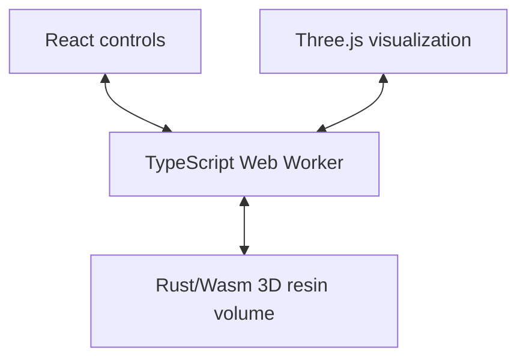

# Two-Photon Lithography Lab

An interactive browser laboratory that connects a sliced Micro-Benchy exposure
path to deterministic reaction–diffusion polymerization and development.

[Open the live lab](https://twophotonlithography.com)

## What is implemented

- Parameter-driven Micro-Benchy slicing with layer, hatch, contour, scan-speed,
  power, and motion controls
- A timestamped Three.js exposure view with layer inspection
- One authoritative adaptive 3D Rust/WebAssembly resin simulation running
  inside a TypeScript Web Worker, never on the browser main thread
- Fixed-step fields for photoinitiator, oxygen, radical activity, conversion,
  developer, and remaining mass
- Development based on computed transport, conversion-dependent resistance,
  and remaining material
- Deterministic A/B replay for any changed model parameter
- Runtime diagnostics that identify the solver, grid, timestep, simulated model
  time, update rate, checksum, and Wasm memory use

The 3D viewport and the Reaction Lens are two views of the same numerical
volume. The lens is an XY section at the layer selected by the shared section
slider; it is not a second simulation. React and Three.js cannot mutate the
authoritative chemistry state, and there is no decorative fallback if
WebAssembly initialization fails.

## Architecture



- React owns controls, interaction, run state, and the diagnostics display.
- Three.js owns visualization only.
- The Web Worker initializes Wasm, validates the snapshot contract, schedules
  simulation batches, handles messages, quantizes render inputs, and transfers
  JavaScript-owned buffers to the main thread.
- Rust owns the volume parameters, authoritative scan trajectory, numerical
  state, adaptive reaction/diffusion integration, development, deterministic
  checksum, and diagnostics.

The whole-Benchy view uses the official CreativeTools geometry and a dense,
adaptive three-dimensional resin volume owned by Rust/Wasm. The worker loads a
deterministic occupancy asset, selects a memory tier, schedules the scan, and
copies compact render snapshots; TypeScript does not evolve chemistry.

The main render snapshot packs position, conversion, oxygen, radicals, and
remaining mass for a bounded set of target and surrounding-resin voxels. A
separate reusable slice buffer packs normalized oxygen, raw radical activity,
conversion, remaining mass, and target occupancy for one complete XY grid
plane. Both buffers are copied before transfer, so rendering never receives a
mutable view of Wasm simulation memory.


## Local setup

Prerequisites:

- Node.js `>=22.13.0`
- Rust `1.88.0`, as pinned by `rust-toolchain.toml`
- the `wasm32-unknown-unknown` Rust target
- `wasm-pack 0.13.1`
- Linux with `flock`, `curl`, and GNU `timeout`

Install the pinned Rust toolchain and Wasm build tool:

```bash
rustup toolchain install 1.88.0 \
  --profile minimal \
  --component rustfmt \
  --component clippy \
  --target wasm32-unknown-unknown
cargo install wasm-pack --version 0.13.1 --locked
```

Install JavaScript dependencies and start the development server:

```bash
npm run install:ci
npm run dev
```

`npm run dev` first builds the browser-targeted Wasm package, then starts Vite
and Vinext. Generated Wasm bindings, Cargo targets, dependencies, build
artifacts, Wrangler state, and the Vinext font cache are excluded from Git.

## Build and validate

Build the browser Wasm package directly:

```bash
npm run build:wasm
```

Create and validate a production build:

```bash
npm run build
npm run validate:artifact
npm run start
```

The production build compiles Rust to Wasm before Vinext. Artifact validation
requires an emitted `.wasm` file with the WebAssembly magic bytes, preventing a
JavaScript-only build from being mistaken for this milestone.

Run the complete validation suite:

```bash
npm run lint
npm run typecheck
npm run lint:rust
npm test
```

Focused commands:

```bash
npm run test:rust
npm run parity
npm run test:wasm-worker
npm run test:production-worker
```

- Rust tests cover deterministic replay, render-batch independence, parameter
  validation, diffusion-only and reaction-only behavior, oxygen recovery,
  radical decay, conversion monotonicity, development stability, and snapshot
  dimensions and ordering.
- The focused Wasm test builds the Node-targeted package and verifies the
  authoritative 3D volume, deterministic replay, and XY slice dimensions
  inside a worker thread.
- The production-worker test loads the browser-targeted bundle emitted by the
  production build, initializes its emitted Wasm asset off the main thread,
  exercises the initialization queue, validates transferred snapshot buffers,
  and checks the status and error message protocol.
- `npm run parity` exercises the preserved native reference model against
  representative checkpoints captured by the temporary pre-migration
  TypeScript harness. Neither reference implementation is exported to the
  browser or retained in the production Wasm API.

The parity reference covers no exposure, stationary exposure, a moving scan,
oxygen depletion and recovery, radical decay, conversion accumulation,
development, reset, and replay. Representative pre-migration checkpoints
include:

- stationary-exposure oxygen recovering from `0.019824` after exposure to
  `0.030758`, `0.153388`, and `0.497273` after 60, 300, and 1200 dark steps;
- radical activity reaching a maximum of `1.031305` and decaying to numerical
  zero after 800 dark steps; and
- mean remaining mass decreasing monotonically through development from
  `1.000000` to `0.987210`, `0.610093`, `0.233650`, and `0.007874`.

Small `f32`/engine rounding differences are expected. Large or qualitative
field divergence is a parity failure.

For performance comparisons, benchmark identical release builds, parameters,
exposure histories, and warm-up counts. Report both solver updates per second
and cell-updates per second; do not compare the Web Worker batch cadence with a
single-threaded development-mode JavaScript loop.

## Runtime status and errors

The Reaction Lens panel shows:

- the authoritative XY plane and physical Z position selected by the layer
  slider
- local target-cell oxygen, radical, conversion, and gel statistics
- adaptive 3D grid dimensions and quality tier
- volume updates per second, volume-owned memory, total Wasm memory, and replay
  checksum

The oxygen, radical, conversion, and remaining-mass selector is global: it
changes both the 3D viewport and Reaction Lens. The section-cut toggle applies
the selected Z plane to the Three.js specimen, while the slider requests the
matching complete XY chemistry plane directly from Rust/Wasm.

Controls remain unavailable while Wasm initializes. A load or initialization
failure produces a persistent, visible error and rejects queued commands; the
application does not silently substitute fake chemistry.

## Scientific limitations

This is an educational continuum model, not a calibrated prediction for
a commercial photoresist.

- The bundled 3DBenchy is voxelized offline; arbitrary uploaded STL execution is
  not implemented yet.
- The seed is explicit replay metadata, but the preserved model currently has
  no stochastic term; equal inputs are deterministic without injected noise.
- Time is nondimensional, and parameters are not fitted to a particular resin.
- The whole-volume optical kernel is a circular-polarization vectorial Debye
  integral normalized to fixed specimen power, with adaptively volume-averaged
  two-photon `I²` weights cached for under-resolved focal cells. An adjustable
  photoinitiator peak applies a normalized Gaussian spectral response with a
  fixed 160 nm FWHM; it is not a fitted material spectrum. Thermal
  effects, shrinkage, stress, and experimentally calibrated development
  kinetics remain outside scope.
- Developer ingress uses deterministic distance from bath-accessible specimen
  surfaces rather than a fluid-flow or moving-interface solve.

The recommended next milestone is **validated arbitrary-mesh import and
experimental calibration against a named resin/process dataset**.

## Repository map

- `app/page.tsx` — search-facing field-guide homepage and laboratory entry point
- `app/lab/page.tsx` — interactive laboratory route
- `app/lab-interface.tsx` — slicer state, timeline, controls, and diagnostics
- `app/guides/` — scientific terminology, model-space, and parameter guides
- `app/lab-viewport.tsx` — client-only Three.js viewport
- `app/simulation.worker.ts` — Wasm initialization, authoritative volume
  scheduling, selected-plane extraction, and immutable snapshot transfer
- `rust/reaction-lens/src/whole_volume.rs` — dense 3D resin, vectorial PSF,
  scan timing, exposure chemistry, threshold conversion, and development
- `rust/reaction-lens/` — authoritative 3D volume core, native parity reference,
  and Rust tests
- `scripts/build-wasm.sh` — pinned browser and Node Wasm builds
- `worker/index.ts` — deployable Cloudflare Worker entry
- `tests/` — worker initialization, build-artifact, and rendered-output checks

## License and provenance

This software is licensed under the
[WOFI Software License 1.0](LICENSE). It is registered as an Implementation of
the WOFI Idea
[Browser-based two-photon lithography process simulator](https://wofi.ai/ideas/sha256%3A182f6bf27b400b724d6e77e5a7d10d1d402dede3b5dbcaebb979a897bf74ad2e).
The repository-specific Idea and Implementation lineage is recorded in
[`wofi.json`](wofi.json).

The deployed application carries the same artifacts at
[`/LICENSE.txt`](https://twophotonlithography.com/LICENSE.txt) and
[`/wofi.json`](https://twophotonlithography.com/wofi.json).

## Production deployment

Pushes to `main` are deployed automatically to the existing Hetzner VPS. The
server polls GitHub approximately every three minutes, builds and tests the
exact revision, switches releases atomically, and rolls back if the local
health check fails. The server must have the pinned Rust toolchain, Wasm target,
and `wasm-pack` version installed before deployment. See
[`ops/hetzner/README.md`](ops/hetzner/README.md).
